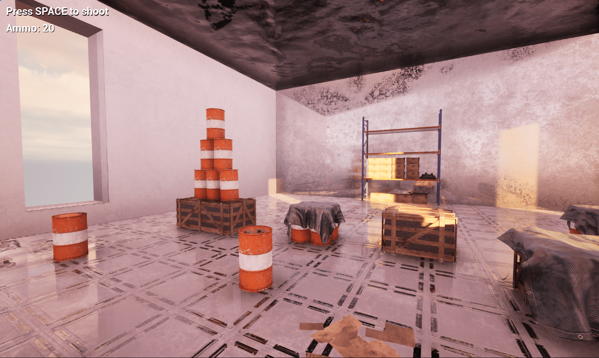

# Tumble

3D physics mini-game made with Unreal. Knock everything over!  

Blueprint project made following [the UE5 "Warehouse Wreckage" tutorial by Gamedev.tv](https://www.gamedev.tv/courses/unreal-5-0-c-developer-learn-c-and-make-video-games).  

